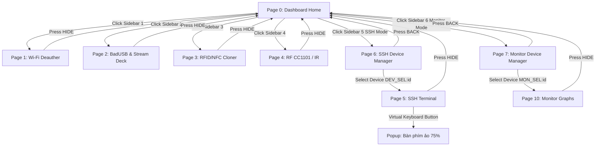

# DWIN HMI: Hướng dẫn Thiết kế Giao diện & Cấu hình DGUS

Tài liệu này cung cấp sơ đồ thiết kế UI/UX cho màn hình **DWIN 7" (1024x600)** với phong cách Dark-Mode Cyberpunk hiện đại, đồng thời đặc tả chi tiết tọa độ và thuộc tính để cấu hình trong phần mềm **DGUS II**.

---

## 1. Thiết kế Giao diện Trang chủ (Page 0)

Dưới đây là bản thiết kế mockup trực quan cho **Trang chủ Dashboard (Page 0)** với tông màu xám tối và các chi tiết điểm nhấn neon (Cyan & Purple):

### Bố cục Không gian (Layout Grid - 1024x600)
*   **Sidebar Navigation (Trái - Rộng 80px):** Chứa 7 Icon chức năng:
    1.  *Dashboard Home* (Trang chủ)
    2.  *Wi-Fi Deauther* (Tấn công Wi-Fi)
    3.  *BadUSB & Stream Deck* (Macro pad)
    4.  *RFID/NFC Cloner* (Sao chép thẻ)
    5.  *Radio CC1101 / IR* (RF & Hồng ngoại)
    6.  *SSH Terminal* (Điều khiển console)
    7.  *Task Manager* (Quản lý đa nhiệm)
*   **Main Header (Trên - Cao 60px):** Hiển thị thanh trạng thái kết nối Wi-Fi (SSID, RSSI), địa chỉ IP, trạng thái VPN Tailscale (neon green nếu connected), và dung lượng pin hệ thống.
### Hệ màu sắc Thiết kế Neon Cyberpunk (Design Color Tokens)
Đồng bộ theo bảng màu CSS của trạm nạp OTA `index.html`:

| Thành phần | Mã màu RGB Hex | Hệ màu DWIN (RGB565) | Mô tả phong cách hiển thị |
| :--- | :---: | :---: | :--- |
| **Nền chính (Background)** | `#030307` | `0x0000` | Xám đen vũ trụ sâu thẳm. |
| **Nền Card (Container)** | `#06060c` | `0x0021` | Xám mờ đục translucent. |
| **Viền Neon Tĩnh (Border)** | `#8b5cf6` | `0x8AEF` | Neon Violet ánh sáng dịu. |
| **Viền Sáng Active (Glow)** | `#bc39fa` | `0xBC1F` | Neon Magenta đậm nổi bật. |
| **Chữ chính (Primary)** | `#f3f4f6` | `0xFFFF` | Trắng sáng, phản xạ cao. |
| **Chữ phụ (Secondary)** | `#a78bfa` | `0xA47F` | Tím pastel nhẹ. |
| **Neon Blue (Kênh vẽ/Chữ)**| `#3b82f6` | `0x3C1F` | Neon Blue sáng cho đồ thị/IP. |

---

## 2. Đặc tả Cấu hình Widget DGUS cho từng Trang

Để giao diện hoạt động chính xác với RP2350, các widget trong DGUS Tool phải được cấu hình đúng tọa độ và địa chỉ VP:

### Trang 0: Dashboard Home
*   **System Log Terminal:**
    *   *Widget:* Text Display (ASCII)
    *   *VP Address:* `0x0098`
    *   *Tọa độ:* X=120, Y=180, Rộng=800, Cao=380
    *   *Cấu hình chữ:* Font size = 16, Font Color = Neon Green (`0x07E0`), Align = Left, Line spacing = 4.
*   **System Status indicators:**
    *   *Widget:* Variable Icon (hiển thị trạng thái kết nối)
    *   *VP Address:* `0x0150` (0 = Disconnected, 1 = Wi-Fi connected, 2 = VPN Active).
*   **Weather Widget (Thông tin thời tiết):**
    *   *Nhiệt độ (Temperature):* VP `0x0160` (16-bit Integer, e.g. `28` displays as `28 °C`) - Tọa độ: X=820, Y=20
    *   *Độ ẩm (Humidity):* VP `0x0162` (16-bit Integer, e.g. `75` displays as `75 %`) - Tọa độ: X=920, Y=20
    *   *Icon Thời tiết (Weather Icon):* VP `0x0164` (Variable Icon: 0 = Nắng, 1 = Mây, 2 = Mưa, 3 = Dông sét) - Tọa độ: X=780, Y=15

### Trang 1: Wi-Fi Deauther
*   **Console Output Area:**
    *   *Widget:* Text Display (ASCII)
    *   *VP Address:* `0x0400`
    *   *Tọa độ:* X=120, Y=100, Rộng=580, Cao=450
*   **Nút Bấm Cảm ứng (Touch Controls):**
    *   *Widget:* Return Key Code (gửi lệnh dạng chuỗi)
    *   *Nút "Quét AP":* Touch Box `(X=750, Y=100, Rộng=200, Cao=60)`, Value gửi đi = `CMD_DEAUTH_SCAN`
    *   *Nút "Tấn công":* Touch Box `(X=750, Y=180, Rộng=200, Cao=60)`, Value gửi đi = `CMD_DEAUTH_START`
    *   *Nút "Dừng":* Touch Box `(X=750, Y=260, Rộng=200, Cao=60)`, Value gửi đi = `CMD_DEAUTH_STOP`

### Trang 2: BadUSB & Stream Deck Mode
*   **Các phím Macro Pad (4 Phím lớn):**
    *   *Widget:* Return Key Code + Touch Effect
    *   *Nút Macro 1:* Touch Box `(X=150, Y=120, Rộng=180, Cao=140)`, Value = `CMD_MACRO_1`, Icon pressed = ICL ID `2`
    *   *Nút Macro 2:* Touch Box `(X=360, Y=120, Rộng=180, Cao=140)`, Value = `CMD_MACRO_2`, Icon pressed = ICL ID `4`
    *   *Nút Macro 3:* Touch Box `(X=570, Y=120, Rộng=180, Cao=140)`, Value = `CMD_MACRO_3`, Icon pressed = ICL ID `6`
    *   *Nút Macro 4:* Touch Box `(X=780, Y=120, Rộng=180, Cao=140)`, Value = `CMD_MACRO_4`, Icon pressed = ICL ID `8`
*   **Thanh trượt chỉnh Âm lượng (Volume Slider):**
    *   *Widget:* Slide Adjustment
    *   *VP Address:* `0x0300` (dải giá trị 0 - 100)
    *   *Tọa độ:* X=150, Y=320, Rộng=700, Cao=30
*   **Thanh trượt chỉnh Độ sáng (Brightness Slider):**
    *   *Widget:* Slide Adjustment
    *   *VP Address:* `0x0302` (dải giá trị 0 - 100)
    *   *Tọa độ:* X=150, Y=380, Rộng=700, Cao=30

### Trang 6: SSH Device Manager Page (Trang Quản lý & Lựa chọn thiết bị SSH)
Trang hiển thị danh sách các máy chủ có thể kết nối SSH khi bấm chọn biểu tượng SSH Terminal từ màn hình chính:

*   **Danh sách thiết bị (List of 4 Devices):**
    *   *Widget:* Variable Icon (Chấm tròn trạng thái Online/Offline)
        *   Device 1 Status: VP `0x0600` (1 = `🟢` Green, 0 = `⚫` Gray)
        *   Device 2 Status: VP `0x0602`
        *   Device 3 Status: VP `0x0604`
        *   Device 4 Status: VP `0x0606`
    *   *Widget:* Variable Icon (Khung sáng xanh neon khi có session SSH chạy ngầm)
        *   Device 1 Active SSH Session: VP `0x0610` (1 = Hiện khung xanh neon phát sáng, 0 = Ẩn khung)
        *   Device 2 Active SSH Session: VP `0x0612`
        *   Device 3 Active SSH Session: VP `0x0614`
        *   Device 4 Active SSH Session: VP `0x0616`
    *   *Widget:* Return Key Code (Bấm chọn thiết bị)
        *   Device 1 Touch Box: `(X=150, Y=120, Rộng=350, Cao=100)`, Value = `DEV_SEL:1`
        *   Device 2 Touch Box: `(X=520, Y=120, Rộng=350, Cao=100)`, Value = `DEV_SEL:2`
        *   Device 3 Touch Box: `(X=150, Y=240, Rộng=350, Cao=100)`, Value = `DEV_SEL:3`
        *   Device 4 Touch Box: `(X=520, Y=240, Rộng=350, Cao=100)`, Value = `DEV_SEL:4`

### Trang 7: Monitor Device Manager Page (Trang Quản lý & Lựa chọn thiết bị Monitor)
Trang hiển thị danh sách các máy chủ có thể theo dõi tài nguyên vẽ đồ thị khi bấm chọn biểu tượng Resource Monitor từ màn hình chính:

*   **Danh sách thiết bị (List of 4 Devices):**
    *   *Widget:* Variable Icon (Chấm tròn trạng thái Online/Offline)
        *   Device 1 Status: VP `0x0700` (1 = `🟢` Green, 0 = `⚫` Gray)
        *   Device 2 Status: VP `0x0702`
        *   Device 3 Status: VP `0x0704`
        *   Device 4 Status: VP `0x0706`
    *   *Widget:* Variable Icon (Khung sáng xanh neon khi có session Monitor chạy ngầm)
        *   Device 1 Active Monitor Session: VP `0x0710` (1 = Hiện khung xanh neon phát sáng, 0 = Ẩn khung)
        *   Device 2 Active Monitor Session: VP `0x0712`
        *   Device 3 Active Monitor Session: VP `0x0714`
        *   Device 4 Active Monitor Session: VP `0x0716`
    *   *Widget:* Return Key Code (Bấm chọn thiết bị)
        *   Device 1 Touch Box: `(X=150, Y=120, Rộng=350, Cao=100)`, Value = `MON_SEL:1`
        *   Device 2 Touch Box: `(X=520, Y=120, Rộng=350, Cao=100)`, Value = `MON_SEL:2`
        *   Device 3 Touch Box: `(X=150, Y=240, Rộng=350, Cao=100)`, Value = `MON_SEL:3`
        *   Device 4 Touch Box: `(X=520, Y=240, Rộng=350, Cao=100)`, Value = `MON_SEL:4`

### Trang 5: SSH Terminal Console (Màn hình điều khiển dòng lệnh)
Giao diện gõ lệnh từ xa cho máy chủ được lựa chọn, hỗ trợ mã màu ANSI và bộ đệm lịch sử cuộn trang:

*   **Vùng hiển thị Terminal (Console Area):**
    *   *Widget:* Text Display (ASCII)
    *   *VP Address:* `0x0400` (được tiếp nhận dữ liệu log ring buffer từ ESP32-C5)
    *   *Tọa độ:* X=100, Y=80, Rộng=820, Cao=400
*   **Bàn phím ảo trượt lên (Virtual Keyboard Overlay):**
    *   *Nút kích hoạt bàn phím:* Touch Box `(X=850, Y=500, Rộng=100, Cao=60)`, Value gửi đi = `CMD_POP_KEYBOARD`. Gọi hiển thị Popup bàn phím 75% tại trang DWIN tương ứng.

### Trang 10: Resource Monitor Graph (Đồ thị Giám sát Tài nguyên)
Vẽ trực quan 3 thông số CPU, RAM và Disk của thiết bị được kết nối theo dạng thời gian thực (60s gần nhất):

*   **Nhãn chỉ số Text:**
    *   *Widget:* Text Display (ASCII)
    *   *CPU Load VP:* `0x0480` - Tọa độ: X=150, Y=100
    *   *RAM Usage VP:* `0x0482` - Tọa độ: X=450, Y=100
    *   *Disk Space VP:* `0x0484` - Tọa độ: X=750, Y=100
*   **Đường cong đồ thị (Real-time Curves):**
    *   *Widget:* Real-time Curve (vẽ đường đa điểm DWIN)
    *   *Kênh vẽ (Channels):* Cấu hình 3 kênh màu khác nhau tương ứng với dữ liệu trả về từ lịch sử:
        *   Kênh 0 (CPU): Neon Pink (`#f472b6`)
        *   Kênh 1 (RAM): Neon Purple (`#c084fc`)
        *   Kênh 2 (Disk): Neon Blue (`#3b82f6`)

---

## 3. Sơ đồ Luồng Chuyển đổi Trang HMI (Navigation Flow)

---

## 4. Hướng dẫn nạp file ICL đồ họa xuống màn hình DWIN
Sau khi thiết kế các file ảnh nền (BMP/PNG) và Icon trong DGUS Tool:
1.  Xuất các file cấu hình ra thư mục `DWIN_SET` (bao gồm `13_Touch.bin`, `14_Show.bin`, và các file ảnh ICL như `23_Background.icl`, `24_Icons.icl`).
2.  Chép thư mục `DWIN_SET` vào thẻ nhớ MicroSD (định dạng FAT32, Allocation unit size = 4096 bytes).
3.  Tắt nguồn màn hình DWIN, cắm thẻ nhớ vào khe cắm thẻ MicroSD ở mặt sau màn hình.
4.  Cấp nguồn cho màn hình. Màn hình DWIN sẽ hiển thị màu xanh và chạy chữ nạp file liên tục (`SD Card Update...`).
5.  Khi màn hình hiển thị `SD Card Update OK!`, ngắt nguồn, rút thẻ nhớ và bật lại nguồn. Giao diện mới sẽ hiển thị.

---

## 5. Danh sách Prompt để tự tạo Icon (Google Imagen / Midjourney / DALL-E)

Nếu bạn muốn tự generate các icon riêng biệt với chất lượng cao nhất bằng AI, hãy sử dụng cấu trúc prompt mẫu dưới đây. 

> [!TIP]
> **Hướng dẫn tách nền:** Hãy dùng công cụ Remove.bg hoặc Photoshop/Figma để loại bỏ nền đen `solid black` thành dạng trong suốt (`transparent`) trước khi import vào DGUS Tool.

### Prompt cấu trúc chung (Design Style Token):
> `Futuristic cyberpunk neon app icon style, flat vector logo design, centered composition on a solid black background, glowing outline, vibrant colors of neon purple, neon pink, and cyan, high contrast, clean shapes, game UI asset`

### Prompt để generate toàn bộ 12 icon trên cùng 1 tấm ảnh (Sprite Sheet Grid):
> `A clean game UI sprite sheet containing 12 distinct cyberpunk neon app icons arranged in a neat 4x3 grid on a solid black background. There is wide black space and clear separation between each icon. The 12 icons are: 1. Home house, 2. WiFi signal antenna, 3. USB computer keyboard, 4. RFID keycard, 5. Radio tower with waves, 6. Infrared remote control, 7. Terminal command prompt window '>_', 8. CPU chip with pulse line, 9. Sunny sun, 10. Weather cloud, 11. Rain cloud, 12. Lightning cloud. All icons are drawn as vibrant glowing vector outlines in neon purple, pink, and cyan. Flat vector asset sheet, black background, no overlapping elements.`

### Danh sách Prompt chi tiết cho từng Icon:

1.  **Icon Home (Trang chủ):**
    *   *Prompt:* `Futuristic cyberpunk neon app icon style, a glowing outline of a modern smart house, flat vector logo design, centered composition on a solid black background, vibrant colors of neon purple and pink, high contrast, game UI asset`
2.  **Icon WiFi (Wi-Fi Deauther):**
    *   *Prompt:* `Futuristic cyberpunk neon app icon style, a glowing outline of a wireless WiFi symbol with a small radar antenna, flat vector logo design, centered composition on a solid black background, vibrant colors of neon cyan and violet, high contrast, game UI asset`
3.  **Icon Keyboard (BadUSB & Stream Deck):**
    *   *Prompt:* `Futuristic cyberpunk neon app icon style, a glowing outline of a computer keyboard with a USB connector cable, flat vector logo design, centered composition on a solid black background, vibrant colors of neon pink and cyan, high contrast, game UI asset`
4.  **Icon RFID/NFC (Sao chép thẻ):**
    *   *Prompt:* `Futuristic cyberpunk neon app icon style, a glowing outline of a contact-less RFID chip card with signal waves, flat vector logo design, centered composition on a solid black background, vibrant colors of neon purple and blue, high contrast, game UI asset`
5.  **Icon Radio (RF CC1101):**
    *   *Prompt:* `Futuristic cyberpunk neon app icon style, a glowing outline of a radio transmitter tower emitting waves, flat vector logo design, centered composition on a solid black background, vibrant colors of neon cyan and purple, high contrast, game UI asset`
6.  **Icon IR Blaster (Hồng ngoại):**
    *   *Prompt:* `Futuristic cyberpunk neon app icon style, a glowing outline of a remote control with infrared waves, flat vector logo design, centered composition on a solid black background, vibrant colors of neon pink and purple, high contrast, game UI asset`
7.  **Icon SSH Terminal (Dòng lệnh):**
    *   *Prompt:* `Futuristic cyberpunk neon app icon style, a glowing outline of a terminal command prompt window showing ">_", flat vector logo design, centered composition on a solid black background, vibrant colors of neon cyan and green, high contrast, game UI asset`
8.  **Icon Task Manager (Quản lý đa nhiệm):**
    *   *Prompt:* `Futuristic cyberpunk neon app icon style, a glowing outline of a microchip with a heartbeat pulse graph, flat vector logo design, centered composition on a solid black background, vibrant colors of neon pink and blue, high contrast, game UI asset`
9.  **Icon Weather Sunny (Nắng):**
    *   *Prompt:* `Futuristic cyberpunk neon app icon style, a glowing outline of a bright sun with rays, flat vector logo design, centered composition on a solid black background, vibrant colors of neon yellow and pink, high contrast, game UI asset`
10. **Icon Weather Cloudy (Nhiều mây):**
    *   *Prompt:* `Futuristic cyberpunk neon app icon style, a glowing outline of a fluffy cloud, flat vector logo design, centered composition on a solid black background, vibrant colors of neon violet and blue, high contrast, game UI asset`
11. **Icon Weather Rainy (Mưa):**
    *   *Prompt:* `Futuristic cyberpunk neon app icon style, a glowing outline of a cloud with glowing raindrops, flat vector logo design, centered composition on a solid black background, vibrant colors of neon blue and purple, high contrast, game UI asset`
12. **Icon Weather Stormy (Sấm sét):**
    *   *Prompt:* `Futuristic cyberpunk neon app icon style, a glowing outline of a cloud with a bright neon lightning bolt, flat vector logo design, centered composition on a solid black background, vibrant colors of neon purple and yellow, high contrast, game UI asset`

