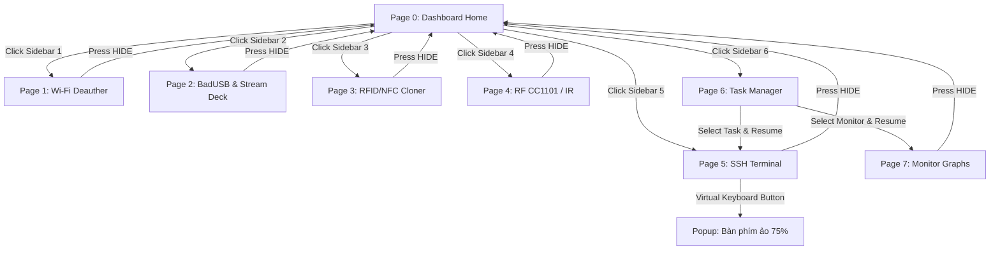

# DWIN HMI: Hướng dẫn Thiết kế Giao diện & Cấu hình DGUS

Tài liệu này cung cấp sơ đồ thiết kế UI/UX cho màn hình **DWIN 7" (1024x600)** với phong cách Dark-Mode Cyberpunk hiện đại, đồng thời đặc tả chi tiết tọa độ và thuộc tính để cấu hình trong phần mềm **DGUS II**.

---

## 1. Thiết kế Giao diện Trang chủ (Page 0)

Dưới đây là bản thiết kế mockup trực quan cho **Trang chủ Dashboard (Page 0)** với tông màu xám tối và các chi tiết điểm nhấn neon (Cyan & Purple):

### Bố cục Không gian (Layout Grid - 1024x600)
*   **Sidebar Navigation (Trái - Rộng 80px):** Chứa 7 Icon chức năng:
    1.  *Dashboard Home* (Trang chủ)
    2.  *Wi-Fi Deauther* (Tấn công Wi-Fi)
    3.  *BadUSB & Stream Deck* (Macro pad)
    4.  *RFID/NFC Cloner* (Sao chép thẻ)
    5.  *Radio CC1101 / IR* (RF & Hồng ngoại)
    6.  *SSH Terminal* (Điều khiển console)
    7.  *Task Manager* (Quản lý đa nhiệm)
*   **Main Header (Trên - Cao 60px):** Hiển thị thanh trạng thái kết nối Wi-Fi (SSID, RSSI), địa chỉ IP, trạng thái VPN Tailscale (neon green nếu connected), và dung lượng pin hệ thống.
*   **Central Workspace (Giữa - 944x540px):** Vùng hiển thị động thay đổi theo từng trang tính năng được chọn.

---

## 2. Đặc tả Cấu hình Widget DGUS cho từng Trang

Để giao diện hoạt động chính xác với RP2350, các widget trong DGUS Tool phải được cấu hình đúng tọa độ và địa chỉ VP:

### Trang 0: Dashboard Home
*   **System Log Terminal:**
    *   *Widget:* Text Display (ASCII)
    *   *VP Address:* `0x0098`
    *   *Tọa độ:* X=120, Y=180, Rộng=800, Cao=380
    *   *Cấu hình chữ:* Font size = 16, Font Color = Neon Green (`0x07E0`), Align = Left, Line spacing = 4.
*   **System Status indicators:**
    *   *Widget:* Variable Icon (hiển thị trạng thái kết nối)
    *   *VP Address:* `0x0150` (0 = Disconnected, 1 = Wi-Fi connected, 2 = VPN Active).

### Trang 1: Wi-Fi Deauther
*   **Console Output Area:**
    *   *Widget:* Text Display (ASCII)
    *   *VP Address:* `0x0400`
    *   *Tọa độ:* X=120, Y=100, Rộng=580, Cao=450
*   **Nút Bấm Cảm ứng (Touch Controls):**
    *   *Widget:* Return Key Code (gửi lệnh dạng chuỗi)
    *   *Nút "Quét AP":* Touch Box `(X=750, Y=100, Rộng=200, Cao=60)`, Value gửi đi = `CMD_DEAUTH_SCAN`
    *   *Nút "Tấn công":* Touch Box `(X=750, Y=180, Rộng=200, Cao=60)`, Value gửi đi = `CMD_DEAUTH_START`
    *   *Nút "Dừng":* Touch Box `(X=750, Y=260, Rộng=200, Cao=60)`, Value gửi đi = `CMD_DEAUTH_STOP`

### Trang 2: BadUSB & Stream Deck Mode
*   **Các phím Macro Pad (4 Phím lớn):**
    *   *Widget:* Return Key Code + Touch Effect
    *   *Nút Macro 1:* Touch Box `(X=150, Y=120, Rộng=180, Cao=140)`, Value = `CMD_MACRO_1`, Icon pressed = ICL ID `2`
    *   *Nút Macro 2:* Touch Box `(X=360, Y=120, Rộng=180, Cao=140)`, Value = `CMD_MACRO_2`, Icon pressed = ICL ID `4`
    *   *Nút Macro 3:* Touch Box `(X=570, Y=120, Rộng=180, Cao=140)`, Value = `CMD_MACRO_3`, Icon pressed = ICL ID `6`
    *   *Nút Macro 4:* Touch Box `(X=780, Y=120, Rộng=180, Cao=140)`, Value = `CMD_MACRO_4`, Icon pressed = ICL ID `8`
*   **Thanh trượt chỉnh Âm lượng (Volume Slider):**
    *   *Widget:* Slide Adjustment
    *   *VP Address:* `0x0300` (dải giá trị 0 - 100)
    *   *Tọa độ:* X=150, Y=320, Rộng=700, Cao=30
*   **Thanh trượt chỉnh Độ sáng (Brightness Slider):**
    *   *Widget:* Slide Adjustment
    *   *VP Address:* `0x0302` (dải giá trị 0 - 100)
    *   *Tọa độ:* X=150, Y=380, Rộng=700, Cao=30

---

## 3. Sơ đồ Luồng Chuyển đổi Trang HMI (Navigation Flow)

---

## 4. Hướng dẫn nạp file ICL đồ họa xuống màn hình DWIN
Sau khi thiết kế các file ảnh nền (BMP/PNG) và Icon trong DGUS Tool:
1.  Xuất các file cấu hình ra thư mục `DWIN_SET` (bao gồm `13_Touch.bin`, `14_Show.bin`, và các file ảnh ICL như `23_Background.icl`, `24_Icons.icl`).
2.  Chép thư mục `DWIN_SET` vào thẻ nhớ MicroSD (định dạng FAT32, Allocation unit size = 4096 bytes).
3.  Tắt nguồn màn hình DWIN, cắm thẻ nhớ vào khe cắm thẻ MicroSD ở mặt sau màn hình.
4.  Cấp nguồn cho màn hình. Màn hình DWIN sẽ hiển thị màu xanh và chạy chữ nạp file liên tục (`SD Card Update...`).
5.  Khi màn hình hiển thị `SD Card Update OK!`, ngắt nguồn, rút thẻ nhớ và bật lại nguồn. Giao diện mới sẽ hiển thị.
